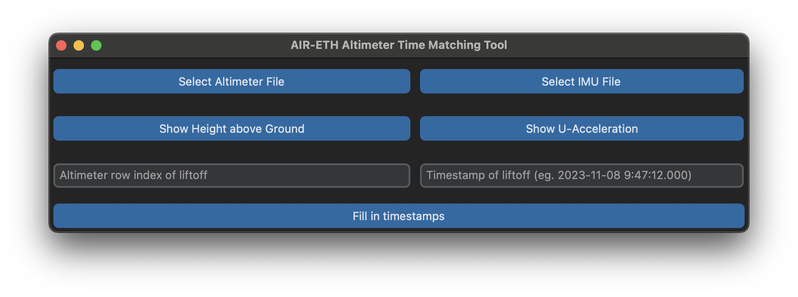

# AIR-ETH Altimeter Time Matching Tool
This application is a GUI tool for loading, visualizing, and processing altimeter and IMU data. It's designed to help match the timestamps of altimeter data with the corresponding IMU data. The application is written in Python and packaged as an executable for Windows for easy deployment.

## Features
Load altimeter data from a CSV file
Load IMU data from a TXT file
Visualize altimeter height and IMU acceleration data using Plotly
Fill in timestamps for altimeter data based on user input of liftoff time and row index
Save processed data to a new CSV file

## Dependencies
Python 3
pandas
tkinter
customtkinter
plotly
webview

## Usage

Run the executable file to start the application.
Use the "Select Altimeter File" and "Select IMU File" buttons to load your data files.
Enter the timestamp of liftoff and the altimeter row index of liftoff in the provided fields.
Use the "Show Height above Ground" and "Show U-Acceleration" buttons to visualize your data.
Use the "Fill in timestamps" button to process the altimeter data and save it to a new CSV file.

## Note
This tool assumes that the altimeter data is in a CSV file with a 'Value' column for height and a 'Time' column for time in seconds. The IMU data is expected to be in a TXT file with columns for 'UTC_DateTime' and 'FreeAcc_U'. Please ensure your data files match this format.

## Executable
The application is packaged as an executable for Windows. Simply download the .exe file and run it to start the application. No installation is required.
